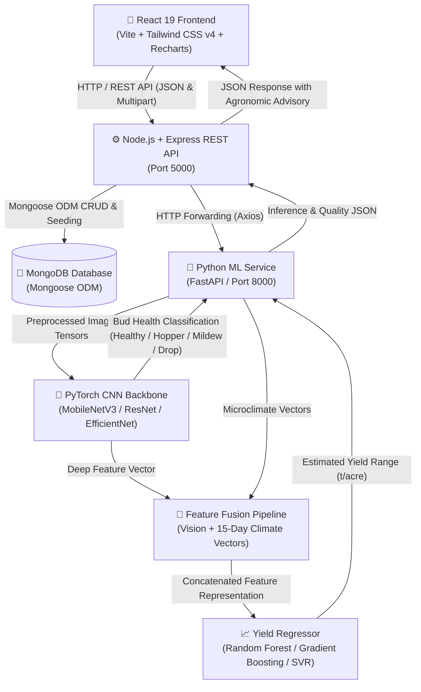

# MangoSense 🥭 — Full-Stack Mango Flower Bud & Yield Prediction System

**MangoSense** is an end-to-end precision agriculture platform designed for mango orchard farmers, agronomists, and agricultural researchers. It enables early-stage mango yield estimation during the crucial flowering and bloom phase by synthesizing computer vision panicle classification, micro-climate telemetry, 15-day weather forecasts, flower-drop risk analysis, and actionable Integrated Pest Management (IPM) advisories.

> **Architectural Note on MEAN Stack:**  
> The project retains the existing React frontend instead of replacing it with Angular, because the frontend was already implemented and the requirement is to integrate the backend without changing the existing UI.

---

## 1. System Architecture Diagram



---

## 2. Directory Structure

```text
MangoSense/
│
├── frontend/                  # Existing React application (preserved UI & design)
│   ├── public/                # Static assets, SVG icons, sample panicle photos
│   ├── src/
│   │   ├── components/        # Dashboard, Analysis Wizard, Yield, Climate, Farms, History
│   │   ├── services/          # API Client and service layers (mock + backend integration)
│   │   ├── App.jsx            # Central router and state container
│   │   └── main.jsx           # Root entry point
│   ├── .env.example           # Frontend environment configuration
│   ├── package.json
│   └── vite.config.js
│
├── backend/                   # MEAN Stack Node.js/Express Backend
│   ├── src/
│   │   ├── config/            # db.js, env.js, recommendationRules.js (threshold-based rules)
│   │   ├── controllers/       # auth, farm, prediction, weather, history, dashboard, recommendation, user, image
│   │   ├── middleware/        # authMiddleware, uploadMiddleware, errorMiddleware
│   │   ├── models/            # User, Farm, Image, Prediction, Weather, Recommendation, HistoryRecord
│   │   ├── routes/            # REST API route handlers (auth, farms, predictions, weather, history, recommendations, dashboard, users, images)
│   │   ├── services/          # mlClientService, weatherService, weatherProviders, recommendationService, seedService, offlineAuthStore
│   │   ├── utils/             # apiResponse
│   │   ├── tests/             # Node native automated API test suite
│   │   └── server.js          # Express app entry point
│   ├── uploads/               # Multipart uploaded bud image storage
│   ├── .env.example
│   ├── package.json
│   └── README.md
│
├── ml/                        # Dedicated Python Machine Learning Service
│   ├── config/
│   │   └── model_config.yaml  # Configurable CNN backbones, hyperparameters, quality thresholds
│   ├── dataset/
│   │   ├── dataset_loader.py  # Group-aware data loader (leakage prevention across farms)
│   │   └── README.md          # Dataset directory structure and collection guide
│   ├── models/
│   │   ├── model_factory.py   # PyTorch CNN model factory with deep feature extractor
│   │   ├── mangosense_cnn.pth # Trained CNN checkpoint (trained on the 16-image dataset — real metrics + small-sample caveat in ml/README.md)
│   │   └── yield_model.pkl    # NOT present yet — no numeric-yield dataset; API uses the disclosed rule-based path (ml/README.md §7)
│   ├── preprocessing/
│   │   ├── image_quality.py   # OpenCV blur detection (Laplacian variance) & illumination checks
│   │   └── preprocessor.py    # Configurable OpenCV resizing & normalization
│   ├── inference/
│   │   ├── predict.py         # Bud health classification and risk assessment
│   │   └── fusion.py          # Visual features + climate vector fusion & yield regression
│   ├── training/
│   │   ├── train.py           # CNN classifier training script with metrics tracking
│   │   └── train_yield_regressor.py # Regression model comparison (RF, GBR, SVR)
│   ├── evaluation/
│   │   └── evaluate.py        # Confusion matrices and classification reports
│   ├── main.py                # Persistent FastAPI microservice
│   ├── requirements.txt       # Python dependencies
│   └── README.md
│
├── package.json               # Root workspace scripts
└── README.md                  # Comprehensive root documentation
```

---

## 3. Technology Stack

| Layer | Technologies | Role |
| :--- | :--- | :--- |
| **Presentation (Frontend)** | React 19, Vite, Tailwind CSS v4, Recharts, Lucide React | Farmer dashboard, multi-canopy capture wizard, interactive sensitivity simulator, dual-axis weather charts. |
| **Backend Runtime** | Node.js (v18+) & Express.js | High-throughput REST API, routing, request validation, authentication, and error handling. |
| **Database** | MongoDB & Mongoose ODM | Document storage for users, orchards/plots, prediction runs, weather logs, recommendations, and history. |
| **File Storage** | Multer | Local multipart disk storage (`backend/uploads/`) with mime-type checking and file-size guardrails. |
| **Authentication** | JWT & bcryptjs | Password hashing, stateless bearer token authentication, protected endpoints. |
| **Machine Learning** | Python 3.10+, PyTorch, torchvision, scikit-learn, OpenCV, NumPy, Pandas | Image quality checks, transfer learning CNN, deep feature extraction, climate fusion, yield regression. |
| **ML Microservice** | FastAPI, Uvicorn | Persistent asynchronous HTTP service communicating directly with the Express backend. |

---

## 4. Database Schema (MongoDB / Mongoose)

1. **`User`**: `name`, `email` (unique index), `password` (bcrypt hash), `phone`, `role` (`farmer`, `agronomist`), `location`.
2. **`Farm`**: `userId` (indexed), `name`, `location`, `totalArea`, `establishedYear`, `soilType`, `irrigationType`, `season` (indexed), `isDemo`, `plots` (array of subdocuments containing `id`, `name`, `variety`, `treeCount`, `treeAge`, `floweringStage`, `healthScore`, `expectedYield`, `yieldUnit`, `flowerDropRisk`, `climateRisk`).
3. **`Image`**: `userId` (indexed), `farmId`, `plotId`, `season` (indexed), `filename`, `url`, `filePath`, `canopyDirection`, `stage`, `quality` (`blurScore`, `isBlurry`, `brightness`), `classification`, `confidence`, `isDemo`. (No bud counts or bounding boxes are ever fabricated or emitted — see CONTRACT.md §0.)
4. **`Prediction`**: `userId` (indexed), `farmId`, `plotId`, `season` (indexed), `variety`, `floweringStage`, `expectedYieldMin`, `expectedYieldMax`, `expectedYieldAverage`, `totalPlotExpectedMin`, `totalPlotExpectedMax`, `factors` (`budHealth`, `climate`, `flowerDropRisk`, `pestRisk`), `modelVersion` (`budModel`, `yieldModel`), `isDemo`.
5. **`Weather`**: `farmId`, `temperature`, `condition`, `humidity`, `rainfall`, `windSpeed`, `solarRadiation`, `vaporPressureDeficit`, `soilMoisture`, `isDemo`, `forecast` (15 daily projections, each carrying `isDemo`), `summary`.
6. **`Recommendation`**: `farmId`, `plotId`, `predictionId`, `category` (`WATER`, `PEST`, `POLLINATION`, `NUTRITION`, `DISEASE`, `WEATHER`), `title`, `priority` (`HIGH`, `MEDIUM`, `LOW`), `shortText`, `fullExplanation`, `actionRequired`, `timing`, `organicAlternative`, `isDemo`.
7. **`HistoryRecord`**: `userId` (indexed), `farmId`, `season` (indexed), `imageIds`, `classification`, `confidence`, `climate` (temperature/humidity/isLive), structured numeric yield fields (`expectedYieldMin/Max/Average`, `totalPlotExpectedMin/Max`), `modelVersion` (`budModel`, `yieldModel`), `plot`, `plotDetails`, `date` (`createdAt` indexed), `budHealth`, `flowerDropRisk`, `climateCondition`, `predictedYield`, `totalTonnes`, `sampleCount`, `keyObservation`, `isDemo`.

---

## 5. REST API Endpoints

> All data endpoints require `Authorization: Bearer <token>` (issued by
> register/login) and are scoped to the authenticated user. Only
> `POST /api/auth/register`, `POST /api/auth/login` and `GET /api/health` are
> public. Demo/fallback payloads are always flagged with `isDemo: true`.

### Authentication
* `POST /api/auth/register` — Register a new farmer account
* `POST /api/auth/login` — Authenticate and receive JWT token
* `GET /api/auth/me` — Retrieve current authenticated user profile

### Users & Images (auth-protected)
* `GET /api/users` / `GET /api/users/me` — Current user (`data: { user }`)
* `GET /api/images?farmId=...&plotId=...` — Image metadata for the signed-in user (`data: { images: [...] }`)

### Farm & Plot Management
* `GET /api/farms` — List the signed-in user's farms and plots (demo farms when no stored farms exist)
* `GET /api/farms/:id` — Retrieve specific farm details (ownership-checked; unknown ids → 404)
* `POST /api/farms` — Create new farm/plot (accepts `season`; 503 when MongoDB is offline)
* `PUT /api/farms/:id` — Update farm/plot (whitelisted fields only — no mass assignment)
* `DELETE /api/farms/:id` — Delete farm

### Flower Bud & Yield Predictions
* `POST /api/predictions/bud` — Multipart upload of up to 10 canopy sample images (`images[]`, `farmId`, `plotId`, `variety`, `floweringStage`, `canopyDirection`, `season`; forwards to ML service for quality validation and CNN inference; zero files → 400)
* `GET /api/predictions/latest?plotId=...` — Retrieve latest yield and bud analysis for plot
* `POST /api/predictions/simulate` — Dynamic "What-If" sensitivity simulator

### Climate & Weather
* `GET /api/weather/current?farmId=...` — Microclimate sensor telemetry (temperature, humidity, rainfall, VPD, solar radiation) + `isDemo`
* `GET /api/weather/forecast?farmId=...` — 15-day agronomic weather forecast (every entry carries `isDemo`)
* `GET /api/weather/summary?farmId=...` — Flower-drop weather risk summary + `isDemo`

Weather provider is selected with env vars in `backend/.env`:

```env
# 'mock' (default) = offline demo data, always flagged isDemo: true
# 'openmeteo'      = live keyless API (https://open-meteo.com), isDemo: false
WEATHER_PROVIDER=mock
OPENMETEO_LATITUDE=16.25
OPENMETEO_LONGITUDE=73.38
OPENMETEO_LOCATION_NAME=Open-Meteo (farm coordinates)
```

### History & Advisory
* `GET /api/history` — Temporal history records for the signed-in user (demo records flagged `isDemo: true` when none stored)
* `GET /api/history/:id` — Detailed single analysis record (ownership-checked)
* `POST /api/history` — Create manual historical log (validated + field whitelist, no raw body spread)
* `GET /api/recommendations` — Rule-based recommendations generated from the latest prediction + weather
* `GET /api/dashboard` — Aggregated dashboard metrics

Recommendation rules live in `backend/src/config/recommendationRules.js`:
each rule is `IF <metric> <op> <threshold> THEN <recommendation>` with all
thresholds exported in `THRESHOLDS` (unit-tested). The rule engine evaluates
the latest prediction and the 15-day forecast; DB-seeded recommendations are
used only as an `isDemo: true` fallback.

---

## 6. Machine Learning Pipeline Details

### Image Quality Validation
- Uses OpenCV to compute **Laplacian variance** to reject out-of-focus and blurry field photographs.
- Validates illumination to detect severe underexposure ($<30$) or overexposure ($>245$).
- Rejects corrupt image formats and enforces minimum resolution ($100\times100$).

### CNN Transfer Learning Architecture
- Supports configurable backbones: **MobileNetV3-Small** (lightweight edge inference), **ResNet-50**, or **EfficientNet-B0/B2**.
- Output classification: *Healthy Bud*, *Mango Hopper Pest Risk*, *Powdery Mildew Risk*, and *Desiccation / Flower Drop Risk*.
- **Deep Feature Extractor**: Extracts penultimate 576-dimensional or 1000-dimensional dense vectors for feature fusion.

### Data Leakage Prevention
- In mango groves, multiple panicle photos taken from the same tree or orchard block can cause severe artificial inflation of test accuracy if randomly shuffled.
- MangoSense implements **`GroupShuffleSplit`** using `farm_id` / `tree_id` as the grouping key, guaranteeing that images from an entire orchard block belong exclusively to either train, validation, or test sets.

### Feature Fusion & Yield Regressor
- Concatenates the deep visual feature representation, 6 normalized microclimatic variables (temperature, humidity, rainfall, wind speed, vapor pressure deficit, soil moisture), and variety encodings.
- Yield models evaluated: **Random Forest Regressor**, **Gradient Boosting Regressor**, and **Support Vector Regressor (SVR)** with MAE, RMSE, and $R^2$ metrics.

---

## 7. Installation and Local Setup

### Prerequisites
- Node.js v18+ and npm
- Python 3.10+ (optional for local ML microservice; backend includes zero-crash heuristic fallback if Python is not running)
- MongoDB (optional; backend includes self-contained offline fallback and memory store)

---

### Step 1: Run the Backend (Express + MongoDB)

```powershell
cd backend
npm install
npm run dev
```

* Backend server runs on: `http://localhost:5000`
* Run backend tests:
  ```powershell
  npm test
  ```

---

### Step 2: Run the ML Service (FastAPI + PyTorch)

```powershell
cd ml
python -m venv venv

# Windows:
venv\Scripts\activate
# Linux/macOS:
source venv/bin/activate

pip install -r requirements.txt
uvicorn main:app --host 0.0.0.0 --port 8000 --reload
```

* ML Service runs on: `http://localhost:8000`
* Interactive OpenAPI Swagger docs: `http://localhost:8000/docs`

---

### Step 3: Run the Frontend (React 19 + Vite)

```powershell
cd frontend
npm install
npm run dev
```

* Frontend application runs on: `http://localhost:5173`

---

## 8. Root Scripts

From the repository root, you can also execute:

```powershell
npm run start:frontend  # Starts the Vite dev server
npm run start:backend   # Starts the Express dev server
npm run test:backend    # Runs the Node test suite
npm run build:frontend  # Builds the production frontend bundle
```

---

## 9. Verification & Prototype Integrity

- **Visual Fidelity Preserved**: The React 19 UI, Tailwind CSS styling, Lucide icons, Recharts dashboards, and mobile navigation are 100% intact.
- **Resilient Fallback**: If the Python ML service or MongoDB is temporarily offline, the Node.js backend never crashes—it transparently serves calibrated agricultural telemetry and records with a clear `isDemo: true` indicator.
- **Reproducible ML Pipeline**: Full training scripts (`train.py`, `train_yield_regressor.py`) and group-aware splitting pipelines are ready to ingest empirical field datasets as soon as they are placed into `ml/dataset/raw/`.
