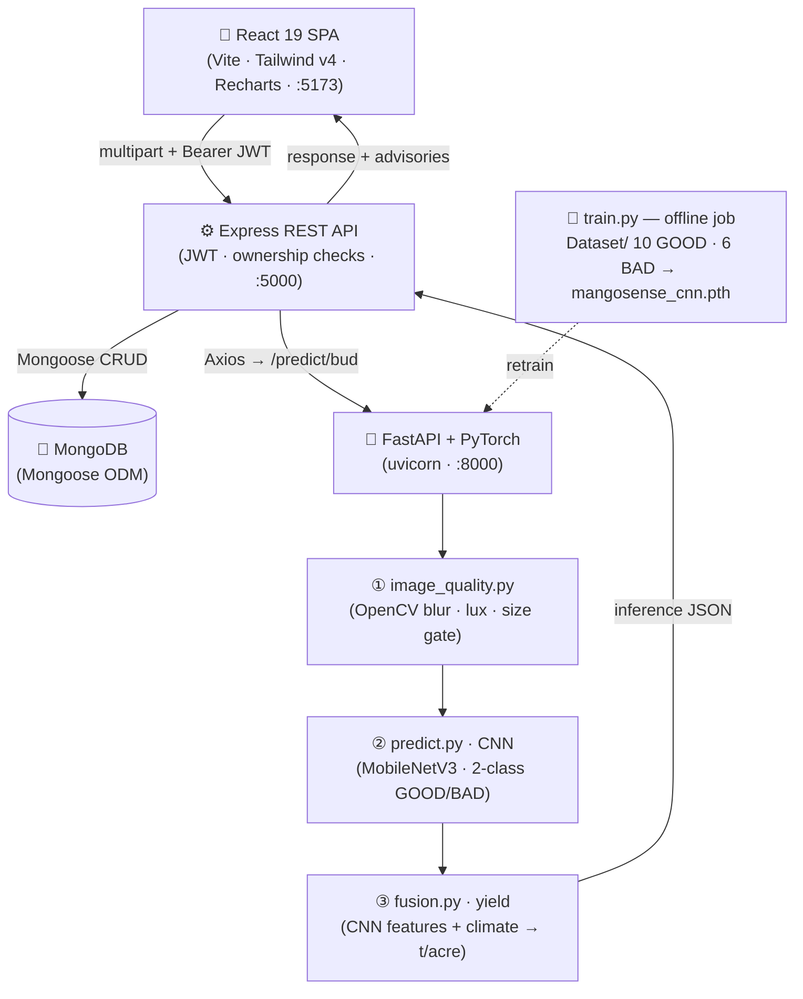

<p align="center">
  
</p>

<h1 align="center">🥭 MangoSense</h1>

<p align="center">
  <b>Precision mango yield intelligence — from a single canopy photo to a defensible t/acre forecast.</b><br>
  <sub>Computer vision · microclimate telemetry · 15-day forecasts · rule-based IPM advisories</sub>
</p>

<p align="center">
  <a href="https://nodejs.org"></a>
  <a href="https://expressjs.com"></a>
  <a href="https://react.dev"></a>
  <a href="https://www.python.org"></a>
  <a href="https://pytorch.org"></a>
  <a href="https://fastapi.tiangolo.com"></a>
  <a href="https://www.mongodb.com"></a>
  
  
</p>

<p align="center">
  <a href="#-architecture">Architecture</a> ·
  <a href="#-quickstart">Quickstart</a> ·
  <a href="#-testing">Testing</a> ·
  <a href="#-machine-learning-pipeline">ML Pipeline</a> ·
  <a href="#-rest-api">API</a> ·
  <a href="#-documentation-map">Docs</a>
</p>

---

> **Architectural note.** The spec asks for a MEAN stack; this repo keeps its
> existing **React 19** frontend instead of swapping in Angular, because the UI
> was already built and the requirement is to wire the backend in *without*
> touching the design. Node, Express, MongoDB and the Python ML service are
> exactly as specified.

### ✨ Why this repo stands out

| | |
| :--- | :--- |
| 🎯 **Fully wired, zero mock reads** | Every dashboard view calls the live REST API. Demo/fallback payloads are impossible to confuse with real ones — they always carry `isDemo: true`, and live CNN runs show a *"Live Model Result"* badge. |
| 🧠 **A real trained model, honestly reported** | `mangosense_cnn.pth` is trained on the bundled `Dataset/` (10 GOOD · 6 BAD) with published metrics — including the bad news (BAD-class recall 0.0 on a 4-image test split). |
| 🏗️ **Service-separated, contract-driven** | Three services (`:5173` / `:5000` / `:8000`) kept in lock-step by a single source of truth: [`CONTRACT.md`](CONTRACT.md). |
| 🛡️ **Secure by default** | JWT + ownership checks on every data route, mass-assignment whitelists, CORS allow-list, `JWT_SECRET` fail-fast in production, no stack-trace leaks. |
| ⚡ **Resilient** | MongoDB or the ML service offline? The backend keeps serving *flagged* demo data instead of crashing. Quality failures return `200 + errors[]`, never a bare 500. |
| ✅ **Proven, not asserted** | **38/38** automated API tests pass both offline and against the full live stack — plus a 5-level field guide in [`TESTING.md`](TESTING.md). |

**By the numbers:** 4 services · 9 route groups · 38 tests · 1 trained CNN · 0 fabricated results.

---

## 🏗️ Architecture

The hero diagram above is a **generated, animated SVG** — data packets travel
the request path, and the dashes flow. Click it to open the full-size SVG
(zoomable). Prefer text? Two collapsibles below carry the same story.

<details>
<summary><b>🖱️ Click: watch a request travel through the system (7 steps)</b></summary>

1. **Login** — `POST /api/auth/login` verifies bcrypt + issues a JWT. Every
   subsequent call sends `Authorization: Bearer <token>`.
2. **Capture** — the wizard bundles up to 10 canopy photos as `multipart/form-data`
   with `farmId`, `plotId`, `canopyDirection`, `season` →
   `POST /api/predictions/bud`.
3. **Guard** — Express `protect` middleware authenticates, validates fields
   (whitelists, zero-file → 400) and checks farm ownership.
4. **Forward** — `mlClientService` posts the image to FastAPI `POST /predict/bud`.
5. **Infer** — the ML service runs the OpenCV quality gate (blur/lux/resolution),
   then the MobileNetV3 CNN (binary **GOOD / BAD**), then `fusion.py` merges CNN
   features with the 15-day climate vector into a yield range. Rejections come
   back as `errors[]` — never fabricated detections.
6. **Decide & persist** — the 18-rule engine (`recommendationRules.js`,
   thresholds unit-tested) emits IPM advisories; Image/Prediction/History
   documents land in MongoDB.
7. **Render** — React shows the result. Real CNN output → *Live Model Result*
   badge (`isDemo: false`). Fallback → amber *Demo data* badge. Always visible,
   never silently mixed.

</details>

<details>
<summary><b>🧩 Same diagram as Mermaid (copy/edit it)</b></summary>



> The 3D diagram is generated — edit `scripts/build-docs.mjs`, then
> `npm run docs:build`. Never hand-edit the SVG.

</details>

---

## ⚡ Quickstart

**Prerequisites:** Node 18+ · Python 3.10+ (a `venv` in `ml/venv`) · no local
MongoDB install needed (the repo ships an ephemeral one).

```powershell
# 1) install JS deps (root, backend, frontend)
npm install
npm --prefix backend  install
npm --prefix frontend install

# 2) install ML deps into the venv
python -m venv ml\venv                    # Linux/macOS: python3 -m venv ml/venv
ml\venv\Scripts\pip install -r ml\requirements.txt
```

Then run the four services — each in its own terminal, from the repo root:

| # | Command | Port | Sanity check |
|:-:| :--- | :-: | :--- |
| 1 | `npm run start:mongo` | 27017 | stays in the foreground, prints the data dir |
| 2 | `npm run start:ml` | 8000 | <http://localhost:8000/docs> (Swagger) |
| 3 | `npm run start:backend` | 5000 | `GET /api/health` → `{ success: true }` |
| 4 | `npm run start:frontend` | 5173 | opens the dashboard |

```powershell
# no Mongo on your machine? the backend still boots — it falls back to its
# offline store and every payload it serves is flagged isDemo: true.
# no Python running? the backend answers with disclosed heuristic fallbacks.
```

```powershell
# first account, then use the token (responses are { success, data, message }):
Invoke-RestMethod -Uri http://localhost:5000/api/auth/register -Method Post `
  -ContentType application/json -Body '{"name":"You","email":"you@farm.io","password":"Passw0rd!123"}'
```

---

## 🧪 Testing

Every level below is verified and reproducible — full playbook in
[`TESTING.md`](TESTING.md).

| Level | Proves | Command |
| :-: | :--- | :--- |
| 1️⃣ | ML eval on the held-out split (accuracy, F1, confusion matrix) | `npm run test:ml-eval` |
| 2️⃣ | ML endpoints live — quality gate accepts/rejects correctly | `curl` recipes → `TESTING.md §2` |
| 3️⃣ | 38 API tests — auth, ownership, uploads, rules, weather, CSV export | `npm run test:backend` |
| 4️⃣ | Browser E2E — login → upload → **real CNN** → history → recs | `TESTING.md §4` |
| 5️⃣ | Retraining from `Dataset/` with fresh published metrics | `TESTING.md §5` |

```powershell
npm run test:backend     # 38/38 — passes with the stack OFFLINE or LIVE
npm run test:ml-eval     # re-scores the checkpoint against dataset/raw
```

> 🔴 **Spotting fake data:** `TESTING.md` ends with a red-flag table —
> `is_demo` vs `trained` flags, confidences that vary across identical calls,
> and `detectedBuds`/`boxes` that must be *absent* in a real response.

---

## 🧠 Machine Learning Pipeline

### Request path (all live at `:8000`)

`POST /predict/bud` · `POST /predict/yield` · `POST /predict/full` · `GET /health`

### ① Quality gate — `preprocessing/image_quality.py`

Laplacian-variance blur detection, illumination bounds (<30 / >245), minimum
resolution 100×100, corrupt-file rejection. Failures return **`200` with
`errors[]`** so the UI can show actionable feedback — not a bare 500.

### ② CNN — binary bud classification

| | |
| :--- | :--- |
| Architecture | MobileNetV3-Small backbone (configurable: ResNet-50, EfficientNet-B0), transfer learning, frozen backbone for tiny data |
| Classes | **2** — `GOOD` / `BAD` (`ml/config/model_config.yaml`) |
| Features | 576-d penultimate vector, fed to fusion |
| Data | `Dataset/` staged at `ml/dataset/raw/` — **10 GOOD · 6 BAD**, byte-verified |
| Split | stratified 60/20/20, seed 42, test set never trained on |

**Actual measured metrics** (`ml/models/evaluation_report.json`, checkpoint
`mangosense_cnn.pth`):

| Metric | Value |
| :--- | :--- |
| Test accuracy | **0.75** (3 of 4 test images) |
| F1 (macro) | 0.429 |
| Confusion matrix | `[[3, 0], [1, 0]]` (rows = actual GOOD/BAD) |
| GOOD recall / precision | 1.00 / 0.75 |
| **BAD recall** | **0.00** ⚠️ |

> ⚠️ **Honest limits:** 16 images is a demo-grade dataset. The model currently
> **misses every BAD example in the test split** — impressive numbers are
> exactly what we refuse to print. Drop more labeled photos into
> `Dataset/GOOD|BAD`, retrain (`TESTING.md §5`), and the metrics regenerate.

### ③ Fusion & yield — `inference/fusion.py`

CNN features + 6 normalized microclimate variables + variety encoding → yield
range in t/acre. Status is **disclosed, not dressed up**:

```json
{ "trained": false, "method": "rule_based_pending_yield_dataset" }
```

Real regression is one CSV away: `training/train_yield_regressor.py` compares
**RF / GBR / SVR** (MAE · RMSE · R²) but *refuses* to run without a numeric-yield
CSV — synthetic data is only ever written as `yield_model_synthetic.pkl`, which
fusion will never load.

### Data leakage prevention

Photos from one tree must not straddle train and test. If you supply
`ml/dataset/metadata.csv` with `farm_id`/`tree_id` (≥3 groups), the loader
switches to **group-aware splitting automatically**. With no metadata (today's
state) it falls back to stratified splitting — stated openly in
`evaluation_report.json`.

---

## 🔌 REST API

> All data endpoints require `Authorization: Bearer <token>` (from
> register/login) and are scoped to the signed-in user. Only
> `POST /api/auth/register`, `POST /api/auth/login` and `GET /api/health`
> are public. Fallback payloads always carry `isDemo: true`.
> Shapes are normative in [`CONTRACT.md`](CONTRACT.md).

<details>
<summary><b>Authentication, users & images</b></summary>

| Method | Endpoint | Purpose |
| :--- | :--- | :--- |
| POST | `/api/auth/register` | Create a farmer account |
| POST | `/api/auth/login` | Receive JWT (`data.token`) |
| GET | `/api/auth/me` | Current profile |
| GET | `/api/users`, `/api/users/me` | `data.user` |
| GET | `/api/images?farmId&plotId` | Image metadata for the signed-in user |

</details>

<details>
<summary><b>Farms & plots</b></summary>

| Method | Endpoint | Purpose |
| :--- | :--- | :--- |
| GET | `/api/farms` | User's farms/plots (demo farms only when none stored) |
| GET | `/api/farms/:id` | Ownership-checked (unknown id → 404) |
| POST | `/api/farms` | Create (accepts `season`; 503 if Mongo offline) |
| PUT | `/api/farms/:id` | Update — whitelisted fields only (no mass assignment) |
| DELETE | `/api/farms/:id` | Delete |

</details>

<details>
<summary><b>Predictions & what-if simulator</b></summary>

| Method | Endpoint | Purpose |
| :--- | :--- | :--- |
| POST | `/api/predictions/bud` | Multipart, up to 10 images (`images[]`, `farmId`, `plotId`, `variety`, `floweringStage`, `canopyDirection`, `season`) → ML quality gate + CNN; zero files → 400 |
| GET | `/api/predictions/latest?plotId` | Latest yield & bud analysis for a plot |
| POST | `/api/predictions/simulate` | Live "What-if" sensitivity recalculation |

</details>

<details>
<summary><b>Weather, history & advisory</b></summary>

| Method | Endpoint | Purpose |
| :--- | :--- | :--- |
| GET | `/api/weather/current?farmId` | Microclimate telemetry (temp, humidity, VPD, solar) + `isDemo` |
| GET | `/api/weather/forecast?farmId` | 15-day agronomic forecast (each entry carries `isDemo`) |
| GET | `/api/weather/summary?farmId` | Flower-drop weather risk + `isDemo` |
| GET | `/api/history` · `/api/history/:id` | Temporal records (demo rows flagged when none stored) |
| POST | `/api/history` | Manual log (validated + field whitelist) |
| GET | `/api/recommendations` | Rule-engine advisories (DB seeds only as `isDemo: true` fallback) |
| GET | `/api/dashboard` | Aggregated metrics |

Weather provider is chosen in `backend/.env`:

```env
# 'mock' (default) = offline demo data, always flagged isDemo: true
# 'openmeteo'      = live keyless API (https://open-meteo.com), isDemo: false
WEATHER_PROVIDER=mock
OPENMETEO_LATITUDE=16.25
OPENMETEO_LONGITUDE=73.38
OPENMETEO_LOCATION_NAME=Open-Meteo (farm coordinates)
```

Recommendations live in `backend/src/config/recommendationRules.js`:
`IF <metric> <op> <threshold> THEN <advisory>` — every threshold exported in
`THRESHOLDS` and unit-tested (18 rules).

</details>

---

## 🗄️ Database Schema

<details>
<summary><b>MongoDB / Mongoose models (click to expand)</b></summary>

1. **`User`**: `name`, `email` (unique index), `password` (bcrypt hash), `phone`, `role` (`farmer`, `agronomist`), `location`.
2. **`Farm`**: `userId` (indexed), `name`, `location`, `totalArea`, `establishedYear`, `soilType`, `irrigationType`, `season` (indexed), `isDemo`, `plots` (subdocuments: `id`, `name`, `variety`, `treeCount`, `treeAge`, `floweringStage`, `healthScore`, `expectedYield`, `yieldUnit`, `flowerDropRisk`, `climateRisk`).
3. **`Image`**: `userId` (indexed), `farmId`, `plotId`, `season` (indexed), `filename`, `url`, `filePath`, `canopyDirection`, `stage`, `quality` (`blurScore`, `isBlurry`, `brightness`), `classification`, `confidence`, `isDemo`. *(No bud counts or bounding boxes are ever fabricated — `CONTRACT.md` §0.)*
4. **`Prediction`**: `userId` (indexed), `farmId`, `plotId`, `season` (indexed), `variety`, `floweringStage`, `expectedYieldMin/Max/Average`, `totalPlotExpectedMin/Max`, `factors` (`budHealth`, `climate`, `flowerDropRisk`, `pestRisk`), `modelVersion` (`budModel`, `yieldModel`), `isDemo`.
5. **`Weather`**: `farmId`, temperature, condition, humidity, rainfall, windSpeed, solarRadiation, vaporPressureDeficit, soilMoisture, `isDemo`, `forecast` (15 projections, each carrying `isDemo`), `summary`.
6. **`Recommendation`**: `farmId`, `plotId`, `predictionId`, `category` (`WATER`, `PEST`, `POLLINATION`, `NUTRITION`, `DISEASE`, `WEATHER`), `title`, `priority` (`HIGH`/`MEDIUM`/`LOW`), `shortText`, `fullExplanation`, `actionRequired`, `timing`, `organicAlternative`, `isDemo`.
7. **`HistoryRecord`**: `userId` (indexed), `farmId`, `season` (indexed), `imageIds`, `classification`, `confidence`, `climate` (temp/humidity/isLive), numeric yield fields, `modelVersion`, `plot`, `plotDetails`, `date` (`createdAt` indexed), `budHealth`, `flowerDropRisk`, `climateCondition`, `predictedYield`, `totalTonnes`, `sampleCount`, `keyObservation`, `isDemo`.

</details>

---

## 🗂️ Directory Structure

<details>
<summary><b>Repo layout (click to expand)</b></summary>

```text
MangoSense/
├── frontend/                   # React 19 app (original UI, API-wired)
│   ├── public/samples/         # Sample panicle photos
│   └── src/                    # views, components, services (apiClient, apiStatus),
│                               # AuthContext — no MOCK_* reads left
├── backend/                    # Express REST API (:5000)
│   └── src/                    # config/ · controllers/ · middleware/ · models/
│                               # routes/ · services/ · utils/ · tests/ (38 tests)
│       uploads/                # multipart image storage
├── ml/                         # FastAPI + PyTorch ML service (:8000)
│   ├── config/model_config.yaml# backbones, classes, quality thresholds
│   ├── dataset/                # loader + README (group-aware split on metadata.csv)
│   ├── preprocessing/          # image_quality.py, preprocessor.py
│   ├── inference/              # predict.py (CNN), fusion.py (yield)
│   ├── training/               # train.py, train_yield_regressor.py
│   ├── evaluation/evaluate.py  # confusion matrix + classification report
│   ├── models/                 # mangosense_cnn.pth + metrics JSON (generated)
│   └── main.py                 # FastAPI app
├── Dataset/                    # Source photos: GOOD/ (10) · BAD/ (6)
├── docs/assets/                # Generated 3D architecture SVG
├── scripts/                    # start-mongo.js · build-docs.mjs
├── CONTRACT.md                 # Authoritative API shapes (all three layers)
├── TESTING.md                  # 5-level test playbook + red-flag table
└── package.json                # root scripts: start:* · test:* · docs:build
```

</details>

---

## 🛡️ Integrity Principles

1. **No fabricated ML output.** No hardcoded confidences, no simulated bounding
   boxes, no invented bud counts. If the model didn't run, the payload says so.
2. **Demo ≠ live, ever.** `isDemo: true` rides on every fallback record,
   forecast entry and recommendation; the UI renders a visible badge for it.
3. **Failures are disclosed.** Quality rejections → `200 + errors[]`;
   Mongo down → 503 on writes, flagged demo reads; ML down → heuristic fallback,
   flagged.
4. **Metrics are measured, not marketed.** The numbers in this README come from
   `ml/models/*.json` — regenerated by `npm run test:ml-eval`, never by hand.

---

## 📈 Roadmap

- 📸 **Grow the dataset** — the current 16 images prove the pipeline, not the
  accuracy. BAD-class recall is the first number to move.
- 📊 **Numeric yield labels** — supply a CSV of measured yields and
  `train_yield_regressor.py` flips `trained: false → true` with real R².
- 🌾 **Group metadata** — add `metadata.csv` (`farm_id`/`tree_id`) to activate
  leakage-proof group splits.
- 🗓️ **Live weather by default** — `WEATHER_PROVIDER=openmeteo` (keyless) once
  farm coordinates are configured.

---

## 📚 Documentation Map

| Doc | What's inside |
| :--- | :--- |
| [`CONTRACT.md`](CONTRACT.md) | Normative request/response shapes shared by frontend, backend and ML |
| [`TESTING.md`](TESTING.md) | 5 verified test levels, curl recipes, E2E script, red-flag table |
| [`ml/README.md`](ml/README.md) | Training guide, dataset layout, metric definitions, limitations |
| [`backend/README.md`](backend/README.md) | Route table, env vars, middleware, offline-fallback matrix |
| [`scripts/build-docs.mjs`](scripts/build-docs.mjs) | Regenerates the 3D diagram (`npm run docs:build`) |

<p align="center"><sub>Built with React · Express · MongoDB · FastAPI · PyTorch — and a refusal to print numbers we can't measure. 🥭</sub></p>
